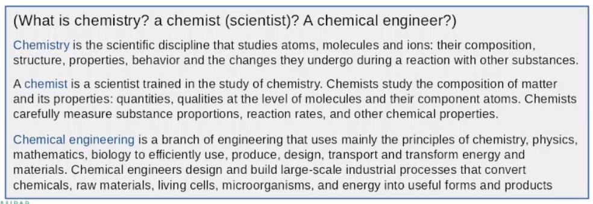

# Introducción al Procesamiento Distribuido de Datos

Profesor: [Gabriel Tamura](https://www.icesi.edu.co/profesores/cv/gabriel-tamura).

## Contenido

- [Introducción al Procesamiento Distribuido de Datos](#introducción-al-procesamiento-distribuido-de-datos)
  - [Contenido](#contenido)
  - [Introducción al Big Data](#introducción-al-big-data)
    - [Para Recordar](#para-recordar)
    - [Palabras Claves](#palabras-claves)
    - [Preguntas Importantes](#preguntas-importantes)
    - [Notas](#notas)
    - [¿Qué es el Big Data?](#qué-es-el-big-data)
    - [Símil entre la química y la ciencia de datos](#símil-entre-la-química-y-la-ciencia-de-datos)
    - [¿Qué es la ciencia de datos y el científico de datos?](#qué-es-la-ciencia-de-datos-y-el-científico-de-datos)
    - [Los orígenes de la ciencia de datos](#los-orígenes-de-la-ciencia-de-datos)
    - [¿Qué hace un científico de datos como un profesional?](#qué-hace-un-científico-de-datos-como-un-profesional)
    - [Habilidades del científico de datos](#habilidades-del-científico-de-datos)
    - [Big Data: ¿Qué ocurre en internet en un minuto?](#big-data-qué-ocurre-en-internet-en-un-minuto)
    - [El ciclo de vida del Big Data](#el-ciclo-de-vida-del-big-data)
    - [Crecimiento del Big Data](#crecimiento-del-big-data)
    - [Las 4 V de IBM para el Big Data](#las-4-v-de-ibm-para-el-big-data)
    - [📌 RESUMEN](#-resumen)
  - [Big Data and Data Lake](#big-data-and-data-lake)
    - [Para Recordar](#para-recordar-1)
    - [Palabras Claves](#palabras-claves-1)
    - [Preguntas Importantes](#preguntas-importantes-1)
    - [Implicaciones del Big Data](#implicaciones-del-big-data)
    - [Ciencia de Datos y Big Data](#ciencia-de-datos-y-big-data)
    - [¿La nube nos soluciona los retos de big data?](#la-nube-nos-soluciona-los-retos-de-big-data)
    - [3 Dimensiones cuando hablamos de problemas de Big Data](#3-dimensiones-cuando-hablamos-de-problemas-de-big-data)
    - [¿Cual es la infraestructura para hacer procesamiento distribuido de big data?](#cual-es-la-infraestructura-para-hacer-procesamiento-distribuido-de-big-data)
      - [Hardware e Infraestructura](#hardware-e-infraestructura)
      - [Elementos de red](#elementos-de-red)
      - [Red de computadores](#red-de-computadores)
      - [Almacenamiento](#almacenamiento)
        - [La jerarquía de memoria](#la-jerarquía-de-memoria)
        - [DAS](#das)
        - [NAS](#nas)
        - [SAN](#san)
    - [On Premise o Cloud](#on-premise-o-cloud)
    - [Tipos de escalamiento](#tipos-de-escalamiento)
    - [Infraestructura en el negocio](#infraestructura-en-el-negocio)
    - [Data Lake en la Cloud](#data-lake-en-la-cloud)
      - [¿Qué clase de Soporte se necesita?](#qué-clase-de-soporte-se-necesita)
        - [IaaS](#iaas)
        - [PaaS](#paas)
        - [SaaS](#saas)
    - [Retos, Pros y Contras de Cloud](#retos-pros-y-contras-de-cloud)
      - [Retos](#retos)
      - [Cons](#cons)
      - [Pros](#pros)
    - [Como construir un Data Lake](#como-construir-un-data-lake)
    - [📌 RESUMEN](#-resumen-1)
  - [Del PC al DataLake: Operación básica de GNU/Linux y Configuración de Red](#del-pc-al-datalake-operación-básica-de-gnulinux-y-configuración-de-red)
    - [Para Recordar](#para-recordar-2)
    - [**Palabras Claves**](#palabras-claves-2)
    - [**Preguntas Importantes**](#preguntas-importantes-2)
    - [Notas](#notas-1)
    - [Verificar instalación de herramientas](#verificar-instalación-de-herramientas)
    - [Tipos de Licencia de Software](#tipos-de-licencia-de-software)
      - [Las licencias más comunes](#las-licencias-más-comunes)
    - [Funciones de un sistema operativo](#funciones-de-un-sistema-operativo)
    - [¿Cómo el SO administra los recursos del Hardware?](#cómo-el-so-administra-los-recursos-del-hardware)
    - [Usuarios y Grupos](#usuarios-y-grupos)
    - [Filesystem](#filesystem)

## Introducción al Big Data

### Para Recordar

- Leer [Data Scientist the sexiest job of the 21st century](https://hbr.org/2012/10/data-scientist-the-sexiest-job-of-the-21st-century&ab=Article-Links-End_of_Page_Recirculation)

### Palabras Claves

- **Big Data:** Campo de estudio que trata de extraer valor de grandes volúmenes de datos, tanto estructurados como no estructurados.
Se caracteriza por las 4 V: su volumen, velocidad, variedad y veracidad.

### Preguntas Importantes

- Para una organización que apenas va a entrar a procesar sus datos y buscar valor a partir de ellos. ¿Por dónde empiezo? ¿Un Data warehouse? ¿Definiendo la gobernanza de los datos?

### Notas

- El big data es el detonante de la ciencia de datos.
- El científico de datos, debe conocer el objeto de estudio de la ciencia de datos. En este caso los datos, por lo tanto conoce todo lo relacionado con los datos.

### ¿Qué es el Big Data?

- Es el campo que que trata formas de analizar, extraer información de datasets que son muy grandes o muy complejos para las formas de procesamiento de datos tradicionales.
- Es el objeto de estudio de la ciencia de datos.

### Símil entre la química y la ciencia de datos



- Un científico en química, domina todo sobre los fundamentos de la materia: átomos y moléculas.
- Científico de datos debe dominar todo sobre los fundamentos de los datos.

### ¿Qué es la ciencia de datos y el científico de datos?


- La ciencia de datos permite analizar fenómenos actuales con los datos.
  - La **analítica descriptiva**, busca describir un fenómeno con los datos,  busca explicar que fue lo que pasó (describe que fue lo que ocurrió).
  Se observa el fenómeno, se recolecta datos y se explica el fenómeno con los datos.
  - La **analítica de Diagnostico**, busca la razón por la que el fenómeno ocurre.
  - En la **analítica Predictiva**una vez se entiende el fenómeno, se busca hacer predicciones sobre él.
  Se modela el fenómeno.

- El científico de datos construye soluciones con los datos y modelos obtenidos.

### Los orígenes de la ciencia de datos

- La ciencia de datos de origina a partir de la necesidad de procesar grandes volúmenes de datos (Big Data). Por eso, en sus inicios se consideraba que la ciencia de datos y trabajar con big data era lo mismo.


### ¿Qué hace un científico de datos como un profesional?

- Realiza descubrimientos mientras se nada en los datos.
- Encuentra fenómenos a partir de los datos.
  - Resuelve interrogantes como: ¿Cómo hacemos que el fenómeno ocurra más fuerte? ¿Cómo le sacamos más provecho?
- Es capaz de estructurar datos
- Encuentra estructuras en los datos.
- Analiza los datos.
- Mantiene conversaciones fluidas con los datos.

### Habilidades del científico de datos

- Es importante que el científico de datos tenga un dominio de expertise (El área de negocio con el que va a trabajar, es necesario conocerla).
- Conocer sobre el negocio es un gran diferencial para el científico de datos.


### Big Data: ¿Qué ocurre en internet en un minuto?


### El ciclo de vida del Big Data


- La ingesta de datos trata sobre la obtención y almacenamiento de los datos.
- Al finalizar el ciclo de vida del big data, los modelos y resultados que se alcancen hay que ponerlos en acción. Es decir, tomar decisiones con base en los resultados obtenidos.
- Hay que asegurarse que los datos pueden ser explotables en la posteridad.
  Por ejemplo: Debido a que alguien sacó los datos del clima desde 1899, hoy se usan esos datos para predecir el clima y ver la evolución del calentamiento global.

### Crecimiento del Big Data

- El Big Data tiene un crecimiento exponencial.


- Es importante interiorizar las medidas de los datos.
- Entender las medidas de tamaño de los datos permite dar una idea de la magnitud del problema que se va a enfrentar.


### Las 4 V de IBM para el Big Data

- Las 4 V del big data nos permite entender las claves del Big Data.


- **Volumen**: Es la principal característica del big data.
  - En el mundo 7 billones de personas y 6 Billones de teléfono, hay casi la misma cantidad de teléfonos que de personas. ¿Qué se puede hacer con toda la información se genera a partir de todos esos teléfonos? ¿Cual es la magnitud de esos datos?
  
  

- **Velocidad**: Velocidad con la que se produce los datos
  - Procesar datos realtime suele ser el problema más complejo.
  - Si los datos no se capturan en el momento que se produce, el dato se pierde.
  
  

- **Variedad**:
  - Tiene que estar acompañada de la velocidad y el volumen.
  - Cuando hay mucha variedad de datos en grandes volúmenes o en velocidades muy altas. Se vuelve un problema del big data.
  
  
  
  
  
  

- **Veracidad**
  - Es la más difícil de lidiar.
  - Hay muchos datos, y cada vez más datos se quieren. (Entre más datos se tenga en teoría, genera más confianza).
  - Muchos datos tienen falta de veracidad y confiabilidad.
    - Por ejemplo: los datos de encuestas, en donde muchas personas no responden datos reales.
  
  
  
  - ¿Por qué los sensores aunque generan muchos datos son los menos confiables?
    - Falta de calibración.
    - Calidad de los sensores.
    - Al manipularlos también se puede dañar esa data capturada.

- **Valor (Quinta)**:
  - Habilita la posibilidad de obtener valor a traves de la analítica.

### 📌 RESUMEN

- El Big Data nos ayuda con los conjunto de datos que no se pueden procesar con las herramientas tradicionales.
- La ciencia de datos nace a partir de la necesidad de procesar grandes volúmenes de datos.
- Las 4 V del Big Data nos permite entender las claves del Big Data.
- Las 4 claves del big data son: Volumen, Velocidad, Variedad y Veracidad.
- El crecimiento del Big Data es exponencial.
- Como científicos de datos debemos tener un dominio de expertise.
- Como científicos de datos debemos entender todo lo relacionado con los datos, desde sus fundamentos.

## Big Data and Data Lake

### Para Recordar

### Palabras Claves

### Preguntas Importantes

### Implicaciones del Big Data


- Esta es la cantidad de datos que genera dos motores de los vuelos de un Boeing 737.
Si se quiere hacer análisis de estos motores para saber cuando hacer el mantenimiento ¿Cómo se le daría manejo a esta cantidad de datos?

- Si se quiere  trabajar con estos datos toca resolver los problemas de:
  - Adquisición de los datos
  - Almacenamiento de los datos.
  - Recuperación: Estos datos se generan muy rápido ¿Cómo se se le da manejo?
  - ¿Cómo se distribuye esta información?
  - ¿Cómo se procesa?


- Algunas preguntas que surgen al manejar big data:


- ¿Qué otras variables afectan a los datos que estamos almacenando y que no los estamos contemplado?
  Por ejemplo: los datos recogidos por los sensores están capturando bien los datos? el clima, la temperatura, la humedad o cualquier otro factor los puede estar afectando y estos factores que pueden afectar nuestros datos lo estamos contemplando?
  Son preguntas que tenemos que realizarnos al trabajar con Big Data.

### Ciencia de Datos y Big Data

- La ciencia de datos surge a partir de la big data.


- Definitivamente no se deben borrar los datos.
No se sabe que datos son importantes como para borrarlos.
- Hacer procesamiento secuencial de Big Data puede ser muy demorado, normalmente es mejor usar procesamiento distribuido.

### ¿La nube nos soluciona los retos de big data?

- No en todos los casos.
- Por si solo usar una maquina cloud con grandes recursos para trabajar en Big Data no en todos los casos es suficiente.


- Con Big Data hablamos de problemas grandes, por lo que necesitamos de una infraestructura que nos permita escalar.

### 3 Dimensiones cuando hablamos de problemas de Big Data


- Hay muchos problemas y retos que tratar cuando hablamos de Big Data ¿Y las soluciones?
  - Para las soluciones nos remontamos hasta el Business Intelligence (BI).
  - Los data warehouse para algunas organizaciones sigue siendo muy bueno.
    - A pesar de que los data warehouse son antiguos aún son validos para varios casos de analítica.


- Los datos pueden estar en varias fuentes, pero los centralizamos para el uso de todos.
- Aunque ya en teoría se tenía soluciones tecnológicas para manejar grandes volúmenes de datos, el big data crea problemas de estrategia y arquitectura.
- Se plantea los data Swamp (Pantanos de datos) para almacenar datos.


- Una evolución de los data swamp son los data lake donde se busca tener los datos más organizados que un data swarm, lo que nos permite más opciones.


- Los datos deben almacenarse de una forma ordenada (La gobernanza de los datos).
- Todos en la organización deben seguir la gobernanza de los datos para que se pueda sacar el máximo provecho de los datos.


- Como ya con un solo computador no podemos procesar los datos, necesitamos **distribuir**.
- Distribuyendo aportamos en:
  - En la escalabilidad y rendimiento de los sistemas.
  - Tolerancia a fallas.
    Si un computador falla durante el procesamiento no perdemos todo el trabajo realizado.
  - Facilita trabajar con una gran variedad de formatos.
  - Muchas aplicaciones.
  - Agrega valor.
- La mejor solución que tenemos por ahora para estos problemas son los data lake: Distribución de datos y distribución de procesamiento.

### ¿Cual es la infraestructura para hacer procesamiento distribuido de big data?

- Para construir una infraestructura para el procesamiento distribuido hay que tener en cuenta tres cosas claves: Hardware, software y conceptos básicos de redes.

#### Hardware e Infraestructura

- **Clusters**
  - Se arma con los racks
- **Racks:** Unidad de organización.
  - Puede tener elementos de procesamiento o almacenamiento.
  - Los elementos deben estar interconectados para que trabajen juntos.
  - Se debe escoger con cuidado las unidades de procesamiento y almacenamiento.

  

  - **KVM**: Comparte el mouse, teclado y pantalla para que se pueda manejar una unidad de rack. Solo 1 a la vez.
  - Para acceder a un rack se hace de forma remota desde otro computador.

  

- Debe ordenarse los cables para poder identificarlo. (Normalmente lo hacen los Ingenieros telemáticos o ingenieros de red)
- Los cables de red no pueden ser un desorden.
- Its components.


- Nodos de procesamiento:
- Se debe controlar el calor.

  

- Tiene dos interfaces de red para tener tolerancia de fallos.

#### Elementos de red


#### Red de computadores


#### Almacenamiento

##### La jerarquía de memoria

  

  El Nivel 5:

  

  

- Las latencias normalmente se miden por tipo de operación (escritura, actualizar, borrado, lectura).
- Hay que combinar el gobierno de datos con la arquitectura de datos. El gobierno por si solo no es suficiente.

##### DAS


- **DAS (Direct Attached Storage)**: Caja de almacenamiento, no permite compartir datos con otros computadores.
- Se puede acceder a los datos de un DAS desde otros computadores a partir de la red y un software. Sin embargo, al conectar muchos computadores (4) de esta forma el rendimiento se viene al piso.
- El DAS es una muy buena opción para empezar en organizaciones que están entrando al manejo de datos.
- Ideal para organizaciones que el nivel de madurez es muy bajo.

##### NAS


- Si la empresa tiene un nivel de madurez más alto, donde varios equipos tienen que acceder a los datos es mejor empezar por un NAS.
- Pensado para el uso concurrente por parte de diferentes equipos.
- Aproximadamente hasta 15 personas haciendo tareas de analítica de forma concurrente.
- No se conecta directamente a un computador.
- Solución para los problemas intermedios.

##### SAN

- Cuando los requerimientos sobrepasan las capacidades de un NAS, se pasa al SAN.
- Cuando se enfrenta a problemas de datos más complejos y se requiere un mayor almacenamiento de datos.


- Se agrega una red solo para el almacenamiento de datos.


- Normalmente los servidores de procesamiento se deben conectar al switch de Fibra.
- Los científicos de datos, correrían los modelos sobre los servidores.


### On Premise o Cloud

- Normalmente se busca un balance entre on premise y la nube. Así funciona en la mayoría de las organizaciones con alto nivel de madurez.
- Empezar on premise, ahí se mirar la nube.
- La nube es costosa y requiere buen canal de subida y bajada de internet.
- Si no se tiene experiencia es mejor empezar on premise, dominando la tecnología en sitio.
- Se interactúa de la misma forma on premise o Cloud.
- Por detrás On Premise y Cloud funcionan igual.

### Tipos de escalamiento


- Escalamiento Vertical (**Scale Up**): Se agrega más memoria, más procesamiento, más almacenamiento.
  - Tiene un limite
  - Se da según las necesidades de procesamiento y almacenamiento que se requieran.
  - Es costoso.
  - Tiene mejor performance.
  - Costo de mantenimiento es caro.
  - Cuellos de botella
    - Al estar conectado a un switch para obtener los datos, los procesadores internos tienen que coordinarse para procesar los datos.
  - Limitado por la capacidad del servidor.
- Escalamiento horizontal (**Scale out**): Se agrega más servidores.
  - Es mejor comprar varios computadores pequeños.
  - Genera más problemas para ciertas técnicas y modelos.
  - Operaciones más lentas (menor performance).
  - Costo de transportar datos en la red (Tiempo).
  - Fácil y flexible.
  - Relativamente barato.

### Infraestructura en el negocio


- Los equipos de hardware se vuelven obsoletos.
- Hay que mantener la refrigeración.
- Energía regulada e ininterrumpida.

Estos retos nos llevan a preguntarnos si es mejor ¿Comprar, Leasing o Rentar?

- Comprar y volverse obsoleto generará nuevos costos para actualizar el hardware.

### Data Lake en la Cloud


- Temas legales. Dependiendo de los datos que pueden estar o no dentro del país.
- Buena conexión a internet y confiable.
- Almacenamiento de datos cobro 24-7.
- Se trata de arrendamiento de equipos sobre internet.
- Pago por demanda.


#### ¿Qué clase de Soporte se necesita?


##### IaaS

- Soluciona el problema de:
  - obsolescencia.
  - Refrigeración.
  - Mantenimiento.
- Ofrece la infraestructura.


##### PaaS

- Se tiene todos los servicios genéricos listos para usarlos.
- Ya tiene listo sistemas operativos y todo.


##### SaaS

- Dejan toda la infraestructura y plataforma montada lista para su uso.


### Retos, Pros y Contras de Cloud


#### Retos

- Aspectos legales que datos pueden estar o no fuera del país.
- Complejidad de los stack de software distribuido.
- Dependencias, upgrades y compatibilidad.

#### Cons

- Estimar los recursos que se van a necesitar en la nube.
- Costos financieros.
- Requiere un buen ancho de banda e internet.

#### Pros


- Disponibilidad de recursos instantáneo.
- Escalabilidad horizontal.
- Libre de mantenimiento del hardware.
- No se necesita un equipo muy grande para manejar hardware, networks e infraestructura.
- Te deja concentrar en los objetivos de negocio


### Como construir un Data Lake

- Primero hay que planear
- Pensar en el modelo que mejor encaja en las necesidades de la organización a largo plazo.
- Se construye pensando en su contexto más grande.
- Se debe construir pensando no solo en el data lake sino en todo lo que se va a construir alrededor del data lake.
- Se debe tener el contexto de la organización.


### 📌 RESUMEN

- Los data lake son repositorios de datos centralizados diseñado para almacenar, procesar y proteger grandes cantidades de datos estructurados, semi-estructurados o no estructurados.
  - Cuando se dice datos sin estructurar, hace entender que los datos necesitan pasar por un proceso de estructuración.
- El diseño de los data lake se debe pensar en los requerimientos y capacidad que se necesita a futuro.
- Los data warehouses siguen siendo una opción para muchos problemas de los datos.
- Cuando se construye un data lake, se debe tener en cuenta el contexto de la organización.
- Los DAS, NAS y SAN son infraestructura para el **almacenamiento** de datos.
- Los DAS son ideales para organizaciones que se van a introducir al mundo de los datos.
- Hay que encontrar un balance entre on premise y la nube.
- Los clusters se construyen a partir componentes físicos y lógicos.

## Del PC al DataLake: Operación básica de GNU/Linux y Configuración de Red

### Para Recordar

- Los DAS, NAS y SAN son unidades para almacenamiento.
- Cuando los datos no tienen una estructura se dice datos no estructurados, no está correcto decir datos sin estructurar.
  - Al decir sin estructurar hace parecer que hay que estructurar los datos.
- El diseño del data lake se hace pensando para el futuro.
  - Se debe tener en cuenta los proyectos que se están trabajando ahora y en los que se trabajará en el futuro.
  - Es importante pensar que tipo de contrato se realizará (Compra, renta, etc).
  - Debe pensarse en la escalabilidad.
- Existen componentes físicos y lógicos para construir el cluster.
- La infraestructura computacional significativa se compone de tres cosas importantes:
  - Procesamiento.
  - Almacenamiento.
  - Interconexión y red.
- Tener una buena infraestructura nos ayuda a tener una tolerancia a fallas.
- Es importante tener archivos firmados y verificar la firma de los mismos a la hora de descargarlos.
- Hay que comprobar la integridad desde el punto de vista de la seguridad
Por ejemplo:

    ```bash
    # Verificamos que el archivo este correctamente firmado a partir de un *-shasum.txt
    shasum -c stops-shasum.txt
    stops.csv: OK
    ```

- Si no se cuenta con una conexión a internet estable o los datos son muy grandes se puede partir el archivo en varias partes y luego volverlos a unir.

### **Palabras Claves**

### **Preguntas Importantes**

### Notas

- El computador es la herramienta básica de los científicos de datos.
- Hay 3 formas para usar el PC para manipular datos.
  - De forma Individual
  - Individual-virtualizada: primero se desarrolla parte de la tarea y luego se escala al cluster.
  - Parte de un cluster.

### Verificar instalación de herramientas


### Tipos de Licencia de Software


#### Las licencias más comunes


### Funciones de un sistema operativo

- El sistema operativo es el administrador de los recursos del Hardware.
- El científico de datos debe cuidar los recursos.
  - El consumo de recursos ayuda a saber si un modelo es muy voraz o si tiene problemas de rendimiento.


### ¿Cómo el SO administra los recursos del Hardware?

- Los recursos se deben administrar.
  - La administración de recursos impacta en el rendimiento de los modelos.
- Los SO son.
  - Multi usuario.
    - Se comparte los recursos entre otros usuarios.
  - Multi Procesamiento.
  - Cada programa se ejecuta de forma concurrente.


- Es importante monitorizar los recursos durante el entrenamiento de los modelos, por ejemplo: si vemos que la consumo de nuestra ram, procesador o otro recurso está muy alto esto impactará en los tiempos de entrenamiento.
  - Esto también nos puede indicar si el modelo consume muchos recursos o por el contrario tiene un problema que hace que consuma mucho más recursos del que debería.
- El consumo de recursos nos da información que debemos analizar durante la construcción de nuestros modelos.

### Usuarios y Grupos

- Los grupos sirven para categorizar y organizar los usuarios.
  - Se puede aplicar permisos a grupos que son heredados por los usuarios que formen parte de estos grupos.
  - Hay grupos de usuarios y de sistema
  - Algunos comandos:
  
    ```bash
    # Ver usuarios logueados
    w
    
    # Ver los procesos que está corriendo filtrando por una palabra (en este caso evol)
    ps aux | grep evol
    
    # Ver los procesos que más recursos consume
    # También se puede ver las prioridades.
    top
    ```

### Filesystem

- Es una estructura lógica utilizada para almacenar archivos en una partición.
- Los datos se guardan en el filesystem.
- Define la forma de almacenar, organizar y recuperar todos los archivos del equipo, para hacer todas las operaciones sobre los datos eficientemente.
- Partición: es una estructura físico-lógica en que se divide el espacio de almacenamiento de un disco duro.
